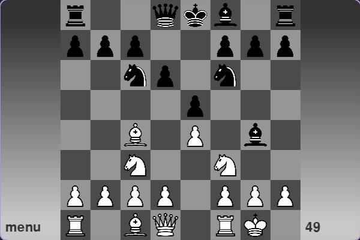

# Shatranjpy

A small chess game implementation in Python.



## Requirements

- Python 3.8 or newer
- [`pygame`](https://pypi.org/project/pygame/)
- [`numpy`](https://pypi.org/project/numpy/)

Install dependencies with:
```sh
pip install pygame numpy
```

## Installation

Clone this repository and run the main script:
```sh
git clone https://github.com/your-username/shatranjpy.git
cd shatranjpy
python src/main.py
```

## Credits

This project was developed on Replit in collaboration with [L-Tragl](https://github.com/L-Tragl)
